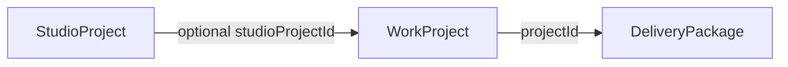

# Mission Control architecture (Studio OS)

This document is the **baseline audit** for how production data links together. Use it when adding timeline intelligence, delivery dashboards, client-facing copy, or webhooks.

## Core entities

- **`StudioProject`** — canonical case study + operational hub (`/admin/projects`, Mission Control). Holds `ProjectStatus`, finance rollups, `shootDate` / `deliveryDate`, stage history, tasks, schedule events, invoices.
- **`WorkProject`** — public `/work` CMS row (section + slug). Optional **`studioProjectId`** links back to the studio record.
- **`DeliveryPackage`** — client-facing delivery bundles. **`projectId` → `WorkProject.id`** (not `StudioProject`). Resolve studio context via `workProject.studioProjectId`.

## Entry points

| Surface | Path | Auth |
|--------|------|------|
| Mission Control home | `/studio` | Admin session |
| Tasks | `/studio/tasks` | Admin session |
| Calendar | `/studio/calendar` | Admin session |
| Studio CMS | `/admin/projects`, `/admin/projects/[id]/edit` | Admin session |
| Delivery hub | `/admin/delivery` | Admin session |
| Client delivery page | `/package/[accessToken]` | Token (public) |
| Client gallery | `/client/access/[token]` | Token |

## Operational feeds

- **`StudioProjectStageHistory`** — append-only production stage transitions; use for dwell time and timeline intelligence.
- **`StudioActivityLog`** — unified internal activity (project, tasks, delivery send, etc.). **Not** exposed to client portals. Append via [`lib/studio/activity-log.ts`](../lib/studio/activity-log.ts).
- **`StudioWebhookLog`** — inbound automation audit + idempotency key storage (`POST /api/studio/automation/events`).
- **`PackageAccessLog`** — per-package view/download telemetry.

## Delivery status vocabulary

Normalized constants live in [`lib/delivery/package-status.ts`](../lib/delivery/package-status.ts) (`PACKAGE_STATUSES`). Persisted as lowercase strings on `DeliveryPackage.status`.

## Client-safe status

Internal `ProjectStatus` must not leak verbatim to clients. Use [`lib/studio/client-facing-status.ts`](../lib/studio/client-facing-status.ts) for package and portal copy.
