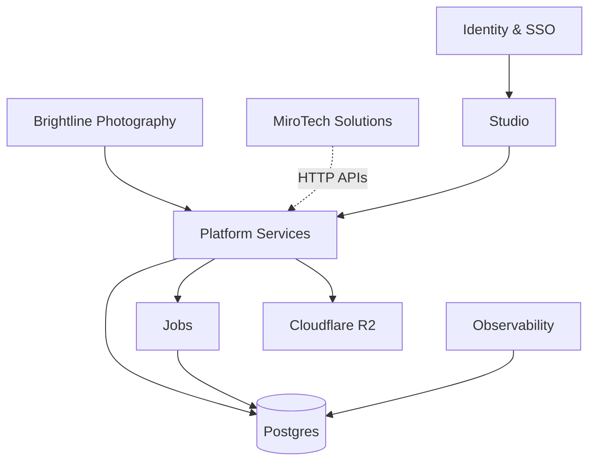
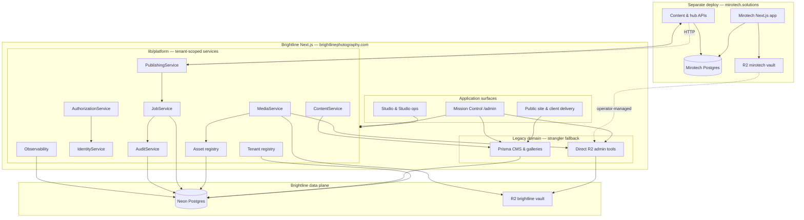

# CLIENT ARCHITECTURE PACKAGE — PHASE 21

**Project:** Brightline Photography ↔ MiroTech Solutions  
**Date:** 2026-08-29  
**Audience:** Clients, engineering leaders, hiring managers, portfolio viewers  
**Policy:** Presentation material only — no application architecture changes.

**Technical depth:** [system-overview.md](./system-overview.md) · [portfolio-summary.md](./portfolio-summary.md) · [ADR index](./README.md)

---

## 1. Client Mermaid diagram

Simplified view (12 meaningful boxes). Top: brands and Studio; middle: platform layer; bottom: data and operations.

---

## 2. Technical Mermaid diagram

Engineering view: service boundaries inside the Brightline modular monolith and external Mirotech deploy.

**Domain boundaries**

| Boundary | Owns | Coupling |
| --- | --- | --- |
| Brightline domain | Photography CMS, galleries, delivery, Studio OS, accountant | Prisma models in Brightline DB |
| Platform domain | Tenants, users, memberships, assets registry, jobs, audit | `platform_*` tables; flags gate cutover |
| Mirotech domain | Mirotech CMS and public site | HTTP APIs + R2 vault — **no shared DB FK** |

---

## 3. Architecture narrative

### BEFORE

Two production web applications served related brands from overlapping operational reality: a photography studio with client galleries and delivery, and a technology consultancy with its own marketing site. Operators crossed both brands daily—syncing journal content, managing media in **two Cloudflare R2 buckets**, and switching between admin surfaces.

Brightline ran as a large Next.js monolith on **Neon Postgres** with dual R2 vaults. Mirotech ran as a **separate Vercel project** with its own Postgres. Cross-brand work duplicated HTTP clients, publish logic, and permission assumptions inside route handlers. A change in one integration path could affect the other brand’s workflows. There was no unified tenant model, no durable job layer for async publishing, and limited cross-brand auditability.

### MIGRATION

The program introduced a **strangler-pattern** platform layer inside the Brightline application—`lib/platform/`—with **feature flags** (`PLATFORM_*`) defaulting to legacy behavior when unset. Additive database tables (`platform_*`) were deployed without destructive migrations. New services (identity, content adapters, media strangler, publishing, jobs, audit) run **beside** existing code; route handlers branch on flags until each domain is validated in staging and production.

**Studio ops** became the cross-brand control plane: tenant context, publishing visibility, and system health—without forcing a single big-bang cutover. Legacy Mission Control (`/admin`) remained authoritative for day-to-day editing during migration. Mirotech stayed an independent deploy; integration remained **HTTP and signed tokens**, not merged schemas.

### AFTER

Today the architecture is **documented and implemented** as:

- **Independent applications** — `brightlinephotography.com` and `mirotech.solutions` deploy and rollback separately.
- **Tenant-aware platform services** — Brightline and Mirotech registered as logical tenants; permissions, jobs, and registry rows carry tenant scope.
- **Incremental cutover in progress** — identity/SSO is enabled in production; media, content, publishing, jobs, and audit flags remain off by default until operator-approved enablement (see [PHASE-20](./PHASE-20-release-readiness-report.md)).
- **Centralized operations surface** — Studio + platform health/metrics; runbooks for deploy, recovery, and alerting.

The migration reduced **risk** by never requiring photography operations, galleries, or client delivery to move in a single release.

---

## 4. Business-value summary

| Outcome | What it means for the business |
| --- | --- |
| **Independent deployments** | A regression on the consultancy site does not require rolling back the photography studio; brands keep separate DNS, Vercel projects, and rollback targets. |
| **Reduced duplicated infrastructure logic** | Upload/sign, publishing, and content reads converge on shared service contracts instead of scattered route-handler copies. |
| **Safer media operations** | Dual R2 vaults with prefix policy, signed URLs, and an optional asset registry reduce accidental cross-vault mistakes and clarify ownership. |
| **Stronger tenant separation** | Memberships, tenant-scoped permissions, and job records limit cross-brand operator mistakes compared to a single undifferentiated admin pool. |
| **Centralized operations** | Studio ops maps cross-brand tools, health probes, and metrics in one control plane while legacy editors still work. |
| **Auditable publishing** | Append-only audit events and structured job results (when enabled) support “who published what, when, and whether it succeeded.” |
| **Future product extensibility** | New job types, publishing adapters, tenants, and agent scopes extend within the platform module—not via new queue SaaS or microservice sprawl. |
| **Lower migration risk** | Strangler flags and compatibility layers let production keep legacy paths until each domain is proven—avoiding downtime-driven rewrites. |

No revenue or performance guarantees are stated here. Evidence-based operational outcomes include **500+ automated unit tests** in the platform program, **production smoke-verified** public routes, and documented **Lighthouse improvements** on Brightline home/work after ISR and hero optimizations (see [PHASE-15C](./PHASE-15C-post-deploy-performance-report.md)).

---

## 5. Case-study copy

### Problem

Brightline Photography and MiroTech Solutions operate as distinct brands with shared operators: photographers and studio staff publish portfolio work, run client galleries, and sync editorial content to the consultancy site—often in the same week. Both brands needed reliable public sites, private client delivery, and admin tooling without one brand’s release jeopardizing the other.

### Architecture challenge

Production already ran on a mature Next.js monolith plus a second deployment for Mirotech. Introducing shared identity, media, publishing, and audit capabilities required **zero tolerance for a big-bang rewrite** that could interrupt client galleries or on-site delivery workflows. Mirotech’s CMS data had to remain in **its own database**; merging schemas would violate brand sovereignty and deployment independence.

### Approach

We treated the Brightline codebase as a **modular monolith**: a `lib/platform/` layer with explicit tenant boundaries, invoked from admin and Studio routes—not a fleet of new microservices. Mirotech remained a **separate Vercel application** integrated via HTTP APIs and operator handoff/SSO tokens.

### Platform design

Platform services cover tenants, identity (with optional cross-domain SSO), authorization, content adapters, media upload/sign strangler, asset registry, publishing, durable jobs, audit, and observability. Each domain is gated by **environment flags** so legacy handlers stay authoritative until cutover evidence supports enablement.

### Migration strategy

**Strangler fig pattern:** additive Postgres tables, dual code paths, Studio integration first, hardening and runbooks before declaring the foundation complete. Photography CMS, R2 admin tools, and client delivery paths were never forced to migrate in a single release.

### Security

Operator APIs use edge CSRF and session controls; private media uses prefix policy and time-bounded signed URLs; client galleries use separate token/session models from staff identity. Threat modeling documented trust boundaries, credential concentration risks, and tenant isolation at the application layer (see [threat-model.md](../security/threat-model.md)).

### Operations

Production runbooks cover Neon migrations, Vercel rollback, cron-driven job drain, manual alerting, and recovery validation. Platform health and admin metrics support operator checks without exposing secrets.

### Outcome

- **Two independent production applications** with verified public availability and separate rollback surfaces.
- **Implemented platform foundation** (16+ ADR-tracked phases) with strangler flags and legacy retirement plan—not a slide-deck architecture.
- **532 unit tests** passing on the Brightline application at Phase 20 gate; delivery-package E2E vertical in CI design.
- **Incremental production evolution** — identity/SSO enabled; other platform paths ready for staged enablement without architectural rework.
- **Performance work shipped in parallel** — Brightline home LCP improved from ~12.4s to ~6.2s (Lighthouse lab) while preserving dynamic client routes.

---

## 6. 90-second interview explanation

**What the system is**

I built and evolved a dual-brand digital platform for a photography studio and a related technology consultancy. There are two independent public websites—Brightline Photography and MiroTech Solutions—each on its own Vercel deployment. Brightline also hosts Mission Control admin, Studio operations, client gallery delivery, and an accountant portal on Neon Postgres and Cloudflare R2.

**The hardest architecture issue**

The hardest part wasn’t picking frameworks—it was **introducing shared platform capabilities without a risky rewrite** while two brands, two R2 vaults, and two Postgres databases already served production. Operators cross brands daily; any “merge everything” approach would have broken client delivery or forced a downtime migration.

**The solution**

I added a **tenant-aware platform layer** inside the Brightline modular monolith: identity, content adapters, media, publishing, jobs, audit, and observability—invoked from Studio and admin routes. Mirotech stays separate; we integrate over **HTTP APIs and SSO**, not shared database foreign keys. Each capability sits behind **feature flags** so legacy code paths remain the default until staging and production prove the new path.

**Why incremental migration mattered**

Photography operations can’t take a maintenance window for architecture vanity. The strangler pattern let us ship additive schema, dual paths, and a Studio control plane while galleries and delivery kept running. We cut over domain by domain—identity first in production, media and publishing ready when operators approve.

**What makes it scalable**

Independent deploys per brand, tenant-scoped permissions and jobs, a durable job table instead of ad-hoc cron scripts for publishing, an asset registry for stable media IDs, and extension points for new tenants and automation—**without** microservice operational overhead on a Hobby-tier hosting budget.

---

## 7. Key technologies

| Layer | Technologies |
| --- | --- |
| **Applications** | Next.js 16 (App Router), React 19, TypeScript |
| **Hosting** | Vercel (separate projects per brand) |
| **Database** | Neon Postgres, Prisma 5 |
| **Media** | Cloudflare R2 (dual bucket / vault model) |
| **Auth** | HMAC admin sessions, optional staff SSO (`jose`), client gallery tokens, accountant JWT |
| **Email / payments / AI** | Resend, Stripe, OpenAI (operator-gated routes) |
| **Testing** | Vitest (500+ unit tests), Playwright (delivery vertical) |
| **Security** | CSP nonces, CSRF on operator APIs, SSRF-safe image fetch, upload MIME allowlists |
| **Observability** | Platform health/metrics, optional Sentry, structured `platformLog` |

---

## 8. Key architecture decisions

| Decision | Rationale |
| --- | --- |
| **Modular monolith + platform module** | One deployable app for Brightline admin/Studio/public keeps latency and ops cost low on Vercel Hobby; `lib/platform/` enforces boundaries without network chatter between services. |
| **Independent Mirotech deploy** | Preserves brand DNS, CMS data sovereignty, and rollback isolation; coupling is HTTP + R2 operator tools, not shared Prisma schema. |
| **Strangler flags (`PLATFORM_*`)** | Production safety: unset flags preserve legacy behavior; enables per-domain cutover with rollback = flip flag off. |
| **Jobs in Postgres + cron drain** | Durable `platform_jobs` with idempotency keys; no Kafka/queue SaaS for a two-tenant operator scale; fits serverless cron on Hobby. |
| **Dual R2 vault abstraction** | Brightline and Mirotech media physically separated; MediaService and registry unify signing/upload policy over both. |
| **Studio as control plane** | Cross-brand map, tenant switcher, publishing/job visibility—without duplicating every legacy admin screen in one release. |
| **Additive migrations only** | Platform tables added without dropping legacy CMS columns; retirement gated on production evidence. |

### Why not microservices everywhere?

The operator scale and team size don’t justify separate deployables for content, media, and publishing. Shared logic lives in **typed services** with tenant scope; the bottleneck was **organizational duplication**, not CPU isolation. Microservices would add network failure modes, cross-service auth, and Hobby-tier transfer costs without improving brand independence—that comes from **separate Vercel projects** for public sites.

### Why not Kubernetes?

Workloads are serverless Next.js on Vercel with managed Neon and R2. There is no long-lived pod fleet to orchestrate. Kubernetes would increase operational surface for a photography/consultancy platform with no container cluster requirement.

### Why not Kafka?

Publishing and hub sync need **durability and retries**, not millions of events per second. Postgres-backed jobs with cron drain provide audit-friendly records, idempotency, and operator-visible failure states—aligned with existing Prisma and deploy model.

---

## Technical challenges (reference)

Selected challenges addressed in the program (evidence in ADRs and phase reports):

1. **Zero-downtime strangler migration** — dual paths + flags; no destructive schema cuts.
2. **R2 dual-vault abstraction** — consistent upload/sign policy across Brightline and Mirotech buckets.
3. **Dual-reference asset migration** — optional `platform_assets` registry + legacy URL keys on portfolio rows.
4. **Cross-site publishing decoupling** — `journal-ingest` and hub HTTP writes; PublishingService behind flags.
5. **SSO across root domains** — short-lived exchange tokens, nonce replay protection, parallel to legacy handoff.
6. **Tenant-aware RBAC** — memberships and namespaced permissions for Studio ops; legacy admin pool bridged during cutover.
7. **Async publishing** — `platform_jobs` with sync fallback when job flag off.

---

*Phase 21 complete. Presentation package only — no code changes.*
