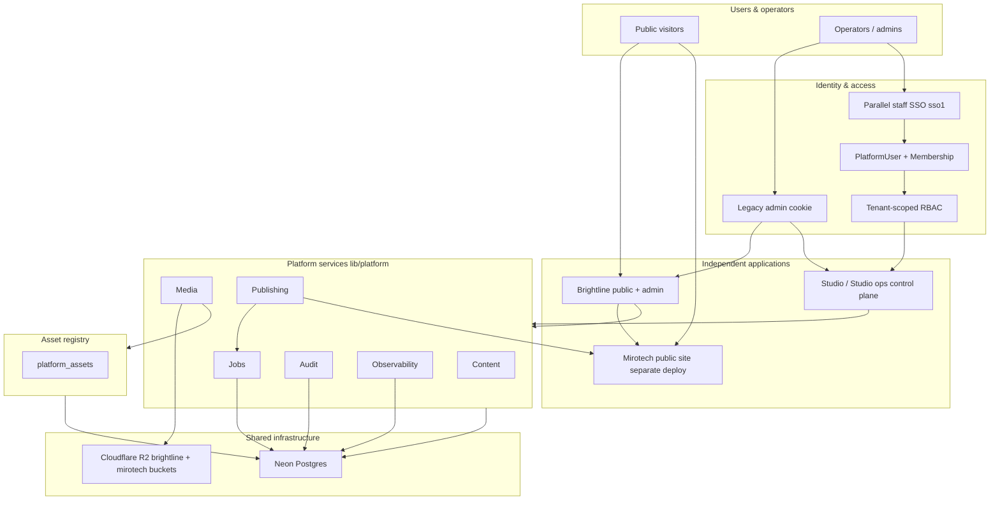
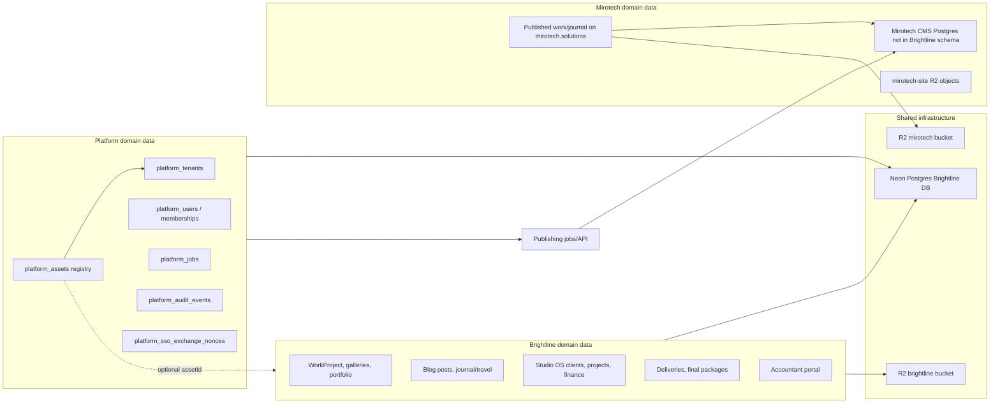
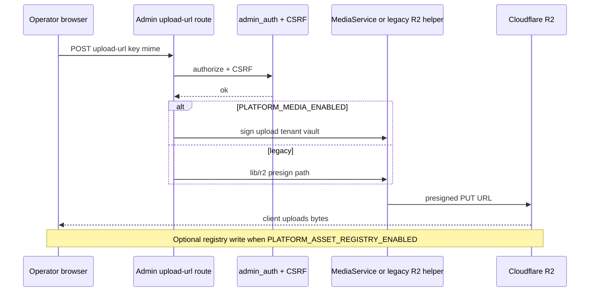
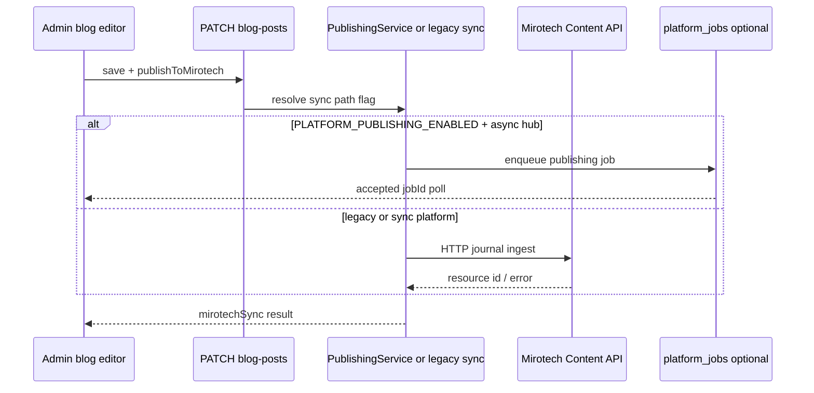
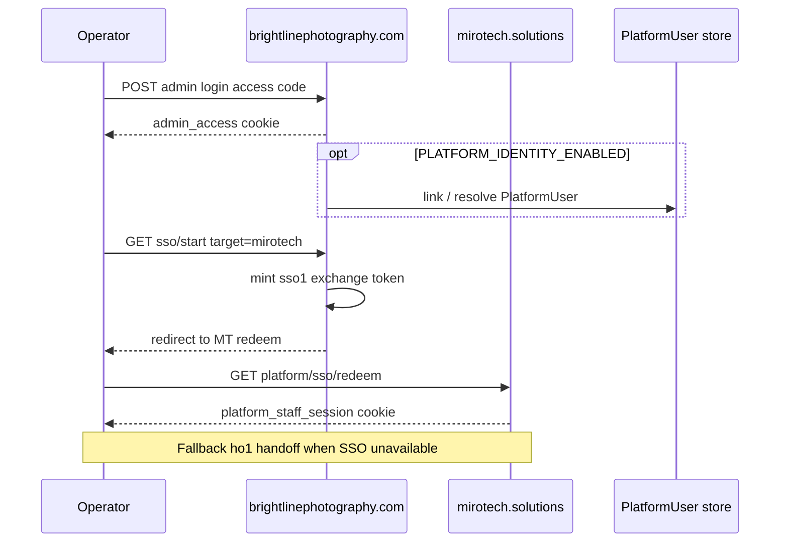
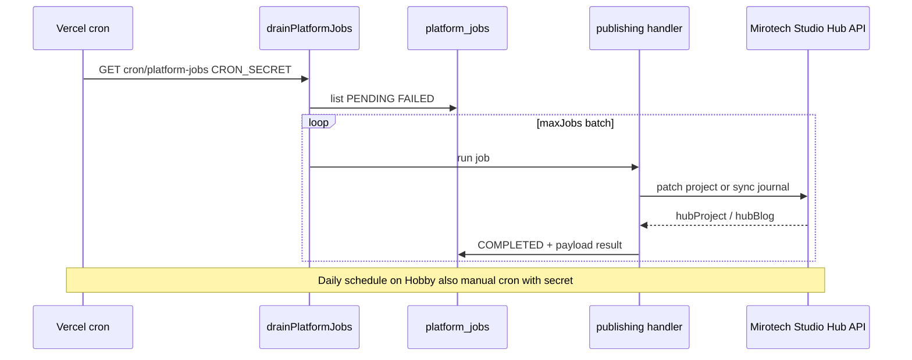

# System architecture overview

**Brightline Photography ↔ MiroTech Solutions**  
**Document date:** 2026-08-28 (Phase 13)  
**Repository:** `brightline/` Next.js application (`brightlinephotography.com`)  
**Related deploy:** `mirotech.solutions` (separate Vercel project)

This document describes **what is implemented today** in this repository and how it connects to Mirotech. It does not describe unbuilt features or roadmap items as shipped.

---

## Executive summary

Brightline and Mirotech are **independent public web applications** with separate production deployments. They share operational patterns, some secrets (handoff/SSO), and integration APIs—but not a single merged codebase or database schema for Mirotech CMS data.

Within the Brightline application, a **platform layer** (`lib/platform/`) provides tenant-scoped services for identity, content, media, publishing, jobs, audit, and observability. **Studio** (`/studio`, `/studio/ops`) functions as the **operational control plane** for cross-brand operators: navigation, tenant context, publishing dashboards, and system probes—without replacing legacy Mission Control (`/admin`) workflows.

Migration from legacy code paths uses **feature flags** (`PLATFORM_*`) so production can run legacy behavior while platform paths are validated. Most flags default **off** when unset; legacy remains the production default for several domains until explicitly enabled.

---

## Application boundaries

### Brightline (this repository)

| Surface | Path | Role |
| --- | --- | --- |
| Public marketing | `/`, `/work`, `/galleries`, `/services`, `/about`, `/contact`, `/blog`, `/travel` | Photography brand site |
| Client delivery | `/client`, `/package/*`, `/final-package/*` | Token/gallery access |
| Mission Control | `/admin` | CMS, R2 tools, Work, portfolio, blog, finance hooks |
| Studio OS | `/studio` | Mission Control tasks, finance, email (existing modules) |
| Studio ops shell | `/studio/ops` | Cross-brand control plane (overview, tenant switch, links) |
| Accountant | `/accountant` | Finance-only portal |

**Hosting:** Vercel (production on Hobby tier per project rules). **Stack:** Next.js 16 App Router, React 19, TypeScript, Prisma 5, Neon Postgres, Cloudflare R2.

### Mirotech Solutions (external)

| Item | Detail |
| --- | --- |
| Deploy | Separate Vercel project at `https://mirotech.solutions` |
| Data | Own Postgres schema and public site—not imported as Prisma models in Brightline |
| Integration | HTTP Content API, Studio Hub admin APIs, R2 `mirotech-site` vault managed from Brightline admin |
| Cross-admin | HMAC handoff (`ho1`) and optional parallel SSO (`sso1`) from Brightline |

Brightline reads Mirotech published content via `lib/dual-brand/content-api.ts` and pushes case studies/journal via `lib/dual-brand/studio-hub.ts` and publishing integrations.

### What is *not* a separate deploy

- **Studio** and **Studio ops** run inside the Brightline Vercel project (same Next.js app as `/admin`).
- **Platform services** are TypeScript modules in `lib/platform/`, invoked from admin/studio routes—not a separate microservice host.

---

## Architecture diagram

Conceptual hierarchy (clarity over exhaustive detail):



---

## Platform services

Implemented modules under `lib/platform/`:

| Domain | Primary entry | Persistence | Flag |
| --- | --- | --- | --- |
| **Tenants** | `lib/platform/tenants/` | `platform_tenants` | Always (foundation) |
| **Identity** | `IdentityService`, SSO | `platform_users`, memberships, legacy links | `PLATFORM_IDENTITY_ENABLED` |
| **Authorization** | `AuthorizationService` | Membership roles → permissions | Gated with identity |
| **Content** | `ContentService` | Legacy CMS tables + adapters | `PLATFORM_CONTENT_ENABLED` |
| **Media** | `MediaService` | R2 + optional registry | `PLATFORM_MEDIA_ENABLED` |
| **Assets** | `AssetRegistryService` | `platform_assets` | `PLATFORM_ASSET_REGISTRY_ENABLED` |
| **Publishing** | `PublishingService` | Jobs + external APIs | `PLATFORM_PUBLISHING_ENABLED` |
| **Jobs** | `JobService`, drain | `platform_jobs` | `PLATFORM_JOBS_ENABLED` |
| **Audit** | `platformAuditService` | `platform_audit_events` | `PLATFORM_AUDIT_ENABLED` |
| **Observability** | health, metrics, `platformLog` | DB probes + in-process counters | Partially always-on |

**Strangler pattern:** When a flag is off, legacy code paths in route handlers and integrations remain authoritative (see [legacy-retirement-plan.md](./legacy-retirement-plan.md)).

---

## Data ownership



| Owner | Owns | Brightline repo access |
| --- | --- | --- |
| **Brightline** | Photography CMS, Studio OS, client delivery, accountant, site settings | Prisma models + R2 `brightline` vault |
| **Platform** | Tenant registry, operator identity, asset registry rows, job records, audit events | `platform_*` tables; no FK to legacy CMS required |
| **Mirotech** | Public Mirotech site content and CMS | HTTP APIs + R2 vault; not direct DB coupling |

Cross-brand linkage uses external IDs, publish flags, and HTTP sync—not shared foreign keys into Mirotech Postgres.

---

## Request flows

### 1. Media upload (admin)



### 2. Content publishing (blog → Mirotech journal)



### 3. SSO / admin access



### 4. Background publishing job



---

## Security model

### Authentication layers (coexist)

| Layer | Mechanism | Scope |
| --- | --- | --- |
| **Legacy admin** | HMAC `admin_access` cookie (`ADMIN_SESSION_SECRET`) | Mission Control + Studio + most admin APIs |
| **Platform staff** | `platform_staff_session` (`ps1`) after SSO redeem | Cross-domain staff session when identity enabled |
| **Accountant** | JWT `accountant_session` | `/accountant` only |
| **Client** | Gallery codes, package tokens, HMAC sessions | Client routes—not PlatformUser |
| **Automation** | Bearer secrets, cron `CRON_SECRET` | Scoped API routes |

`authorizeAdminRequest` remains the primary gate for ~170 admin routes. Platform RBAC does not replace it globally.

### PlatformUser and Membership

- `PlatformUser` — central operator record (email optional, status enum).
- `PlatformMembership` — `(userId, tenantId, role)` with roles `OWNER | ADMIN | EDITOR | VIEWER`.
- Tenants: `brightline`, `mirotech` in `platform_tenants`.
- Legacy admin sessions synthesize OWNER on both tenants until a mapped PlatformUser is resolved.

### RBAC

- Permissions are stable strings (`brightline.journal.publish`, `mirotech.project.read`, `platform.media.read`, etc.).
- `AuthorizationService` resolves effective permissions per subject + tenant.
- Studio ops and publishing APIs use permission helpers in `lib/studio/access.ts`.
- **Legacy admin bypass:** full access when `subjectKind === legacy_admin`.

### Tenant isolation

- Permissions are tenant-scoped (`brightline.*` vs `mirotech.*`).
- Membership required in tenant for platform user permission resolution.
- Job read APIs enforce job `tenantSlug` against operator membership (Phase 12A).
- Asset registry rows carry `tenantId`; storage uniqueness is global per physical object key.

### Service / agent scopes

- `AgentScope` presets exist (`caseStudyDrafter`, `mediaReader`) in `lib/platform/authorization/agent-scopes.ts`.
- **No production agent principals** are wired yet—scopes are preparatory for future automation.

### Private media access

- R2 objects default **private**; public URLs only for allowlisted prefixes (`lib/media-key-access.ts`).
- Admin signing routes require admin auth + key policy.
- Client galleries use separate token/session model—not platform RBAC.
- Upload MIME allowlist and SSRF-safe fetch helpers locked in `lib/truth/security.ts`.

### Edge security

- `proxy.ts`: CSP nonce, admin CSRF on mutating admin/studio/accountant/AI APIs.
- Rate limits on login, SSO redeem, publish triggers, R2 upload-url (Upstash or Postgres buckets).

---

## Deployment model

| Component | Deployment | Notes |
| --- | --- | --- |
| **Brightline** | Vercel project → `brightlinephotography.com` | `npm run deploy:prod`: migrate then `vercel deploy --prod` |
| **Mirotech** | Separate Vercel project → `mirotech.solutions` | Independent rollback boundary |
| **Studio / ops** | Same Brightline deployment | Routes `/studio`, `/studio/ops` |
| **Neon Postgres** | Shared Brightline DB | Mirotech CMS DB separate |
| **R2** | Cloudflare account | Two buckets/vaults from Brightline env |
| **Cron** | Vercel `vercel.json` | `followups`, `platform-jobs` (daily) |

**Rollback boundaries:**

- **App code:** Vercel promote previous deployment (per project).
- **Platform behavior:** `PLATFORM_*` env flags without code rollback.
- **Database:** Forward migrations only in repo—no automated down migrations.
- **Mirotech vs Brightline:** Roll back independently; verify shared secrets if cross-admin breaks.

See [production-runbook.md](../operations/production-runbook.md) and [deployment.md](../deployment.md).

---

## Scale strategy

What can scale **independently** (conceptual—no throughput claims):

| Component | Scaling lever | Constraints in current design |
| --- | --- | --- |
| **Web apps** | Vercel serverless instances per deploy | Hobby tier CPU/transfer budgets; two separate projects |
| **Database** | Neon compute/storage/plan upgrade | Single Brightline Postgres; connection pooling via `DATABASE_URL` |
| **Media** | R2 storage and CDN egress | Objects not streamed through app for public CDN URLs |
| **Jobs** | Cron frequency, `maxJobs` per drain, flag to sync legacy | In-process drain—not external queue; daily cron on Hobby |

**Does not scale as separate services today:** platform modules (in-monolith), job drain (same serverless runtime), audit writes (synchronous insert).

---

## Repository structure (platform-relevant)

```
brightline/
├── app/                    # Next.js pages + API routes
│   ├── admin/              # Mission Control
│   ├── studio/             # Studio OS + ops shell
│   └── api/                # Route handlers incl. platform/*, cron/*
├── lib/
│   ├── platform/           # Tenant-scoped platform layer
│   │   ├── authorization/
│   │   ├── audit/
│   │   ├── assets/
│   │   ├── content/
│   │   ├── identity/
│   │   ├── jobs/
│   │   ├── media/
│   │   ├── publishing/
│   │   ├── observability/
│   │   └── tenants/
│   ├── studio/             # Studio ops context, publishing UI helpers
│   ├── dual-brand/         # Mirotech Content API + Studio Hub clients
│   └── truth/              # Frozen security/nav contracts
├── prisma/                 # Unified schema + migrations
└── docs/architecture/      # ADRs, phase reports, this overview
```

---

## Observability

| Capability | Implementation |
| --- | --- |
| Health | `GET /api/platform/health` (public DB ping); admin extended health |
| Metrics | `GET /api/admin/platform/metrics` — 24h job/audit aggregates |
| Logging | `platformLog` structured logs; correlation IDs |
| Alerting | Manual runbook ([alerting.md](../operations/alerting.md)) |
| Sentry | Optional via `SENTRY_DSN` |

Asset-read counters are **in-process** (reset on cold start)—not durable cluster-wide metrics.

---

## Intentional legacy components (still active)

Per [legacy-retirement-plan.md](./legacy-retirement-plan.md):

- **Dual-path upload/sign routes** when `PLATFORM_MEDIA_ENABLED` is off.
- **Legacy blog Mirotech sync** when `PLATFORM_PUBLISHING_ENABLED` is off (production default in observed env).
- **Handoff tokens (`ho1`)** default on (`LEGACY_ADMIN_HANDOFF_ENABLED`).
- **`lib/storage-r2.ts`** canonical R2 I/O—permanent, not a shim.
- **Unified Prisma schema** for photography + Studio OS—not split per domain.
- **Shared admin access code** for all operators—no per-user admin accounts in legacy path.
- **Portfolio/domain media** mostly keyed by `storageKey`—`platform_assets` bridge optional and lightly adopted.

---

## Related documentation

| Document | Purpose |
| --- | --- |
| [README.md](./README.md) | ADR index |
| [current-state.md](./current-state.md) | Phase 0 inventory |
| [portfolio-summary.md](./portfolio-summary.md) | Client-facing summary |
| [PHASE-13-final-architecture-report.md](./PHASE-13-final-architecture-report.md) | Phase 13 deliverable index |
| [production-runbook.md](../operations/production-runbook.md) | DR and operations |
